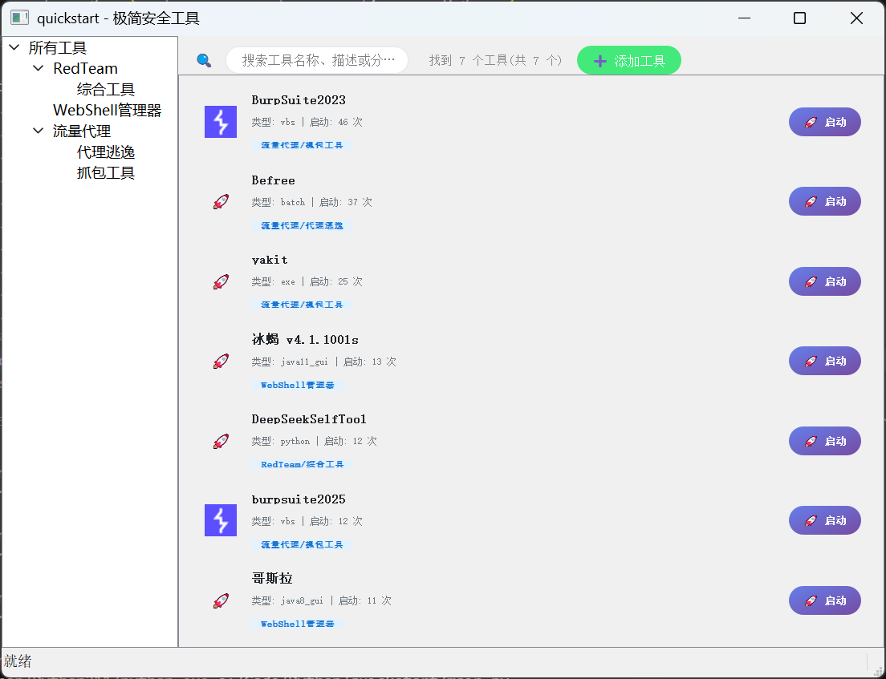
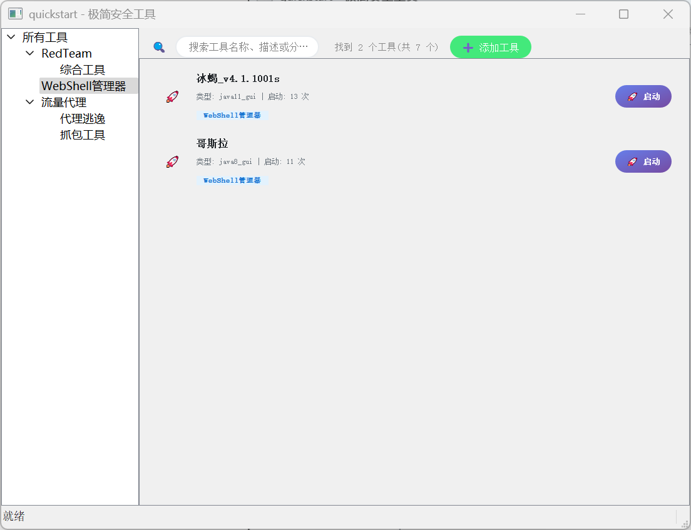
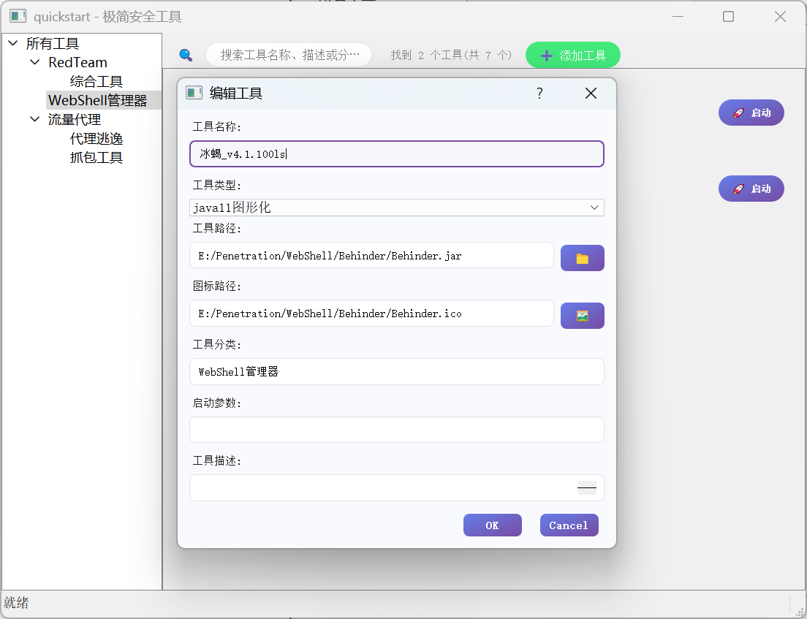
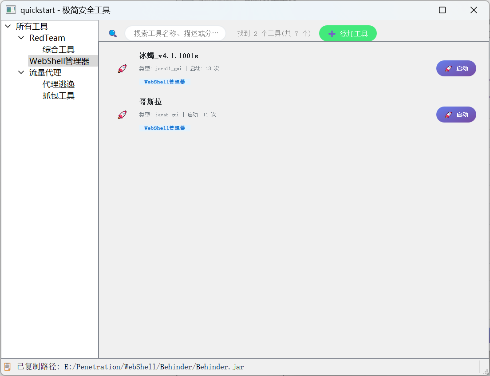

# quickstart - 极简安全工具箱

## 项目简介

`quickstart` 是一个基于 PyQt5 的极简安全工具启动器，支持一键管理、分类、启动常用的渗透测试、红队、代理、WebShell等工具。支持多种类型（exe、bat、vbs、jar、python、文件夹、网页等），并可自定义分类、图标和描述。

## 主要特性

- 支持添加/编辑/删除各种类型的工具
- 工具分类树，支持多级分类
- 工具搜索、统计与启动次数记录
- 自动检测并安装 Python 工具依赖
- 一键打开工具所在文件夹、命令行、复制路径/信息
- 支持自定义图标、启动参数
- ctrl+f 自动聚焦搜索框

## 安装方法

1. **克隆项目**
   
   ```bash
   git clone https://github.com/z50n6/quickstart.git
   cd quickstart
   ```
   
2. **安装依赖**
   ```bash
   pip install -r requirements.txt
   ```

3. **运行主程序**
   ```bash
   python main.py
   ```

## 配置说明

所有工具信息存储在 `config.json` 文件中，格式如下：

```json
{
  "tools": [
    {
      "name": "工具名称",
      "path": "工具路径",
      "category": "工具分类",
      "tool_type": "工具类型",
      "description": "描述",
      "icon_path": "图标路径",
      "launch_count": 0,
      "last_launch": "",
      "args": ""
    }
  ]
}
```

- `tool_type` 支持：`exe`、`batch`、`vbs`、`java8_gui`、`java11_gui`、`java8`、`java11`、`python`、`powershell`、`url`、`folder`
- `category` 支持多级分类（如 `RedTeam/综合工具`）

你也可以在程序界面通过“添加工具”按钮进行可视化配置。

## 依赖说明

- Python 3.8+
- PyQt5 >= 5.15.0

安装依赖：
```bash
pip install -r requirements.txt
```

## 常见问题

- **Python工具依赖自动安装**：如检测到 `requirements.txt`，会自动安装依赖。
- **Java工具**：需配置 `JAVA8_HOME` 或 `JAVA11_HOME` 环境变量，或在 `config.json` 中指定 `java8_path`/`java11_path`。
- **图标**：支持 `.ico`、`.png`、`.jpg` 等格式。

## 截图









